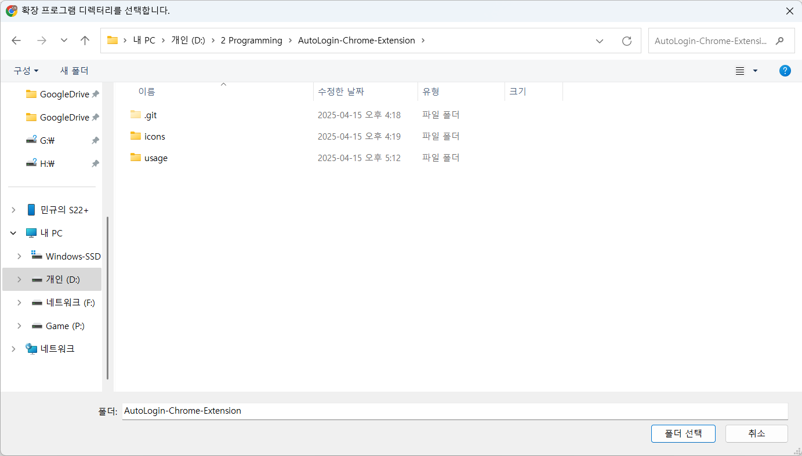

# AutoLogin-Chrome-Extension
[인하대학교 클라우드 허브](https://cloud.inha.ac.kr/) 자동 로그인 확장 프로그램

계속 로그인 창이 뜨길래 자동으로 입력해서 로그인해 주는 프로그램을 개발하게 되었습니다.

## 사용법
### 다운로드
1. 우측의 "Code" 버튼을 누른 후, "Download ZIP"을 선택한다.

### 파일 설정
2. user_example.json 파일을 연다.
3. [id를 입력하세요] 부분에 ID를 입력한다.
4. [password를 입력하세요] 부분에 PW를 입력한다.

> ID가 1234567890 이고, PW가 qwerty12324 일 경우

### 브라우저 설정
5. 브라우저를 실행한다.
6. 확장 프로그램 설정에 들어간다.
7. 개발자 모드를 활성화한다.

|Edge|Chrome|
|---|---|
|확장 프로그램 설정 주소|확장 프로그램 설정 주소|
|edge://extensions/|chrome://extensions/|
|||
|좌측 중간에 "개발자 모드"|우측 상단에 "개발자 모드"설정 존재|

8. 파일을 불러온다.

|Edge|Chrome|
|---|---|
|||
|"압축 풀린 파일 로드" 클릭|"압축해제된 확장 프로그램을 로드합니다." 클릭|

9. 파일 디렉토리(압축 해제한 폴더)를 선택합니다.

|Edge|Chrome|
|---|---|
|||

10. 다음과 같이 확장 프로그램이 인식되면 성공입니다.

|Edge|Chrome|
|---|---|
|||

- 오류라고 표시되는 부분은 무시하셔도 됩니다.
- 자세한 정보: popup.html이 없어서 발생한 에러인데, 실행 시 아무 영향 없이 정상적으로 작동합니다. :)